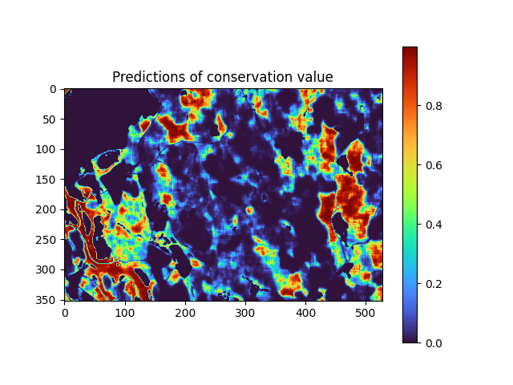

# BIOSCANN
BIOSCANN: BIOdiversity Segmentation and Classification with Artificial Neural Networks

This tutorial shows the basic commands for running the `bioscann` pipeline to make predictions of conservation value across national scale (in this case applied to forests in Sweden). 
This includes the following main steps:
- installation of `bioscann` (installation tested on MacOS)
- preparation of training data
- model-training
- predictions of conservation value

## Download project from GitHub
Download the `bioscann` GitHub repo and navigate into the project folder using your command line. For the installation in the next step you need to have the installation manager `conda` installed (download [here](https://docs.anaconda.com/miniconda/)).

## Installation
You install the software as a conda package by executing the commands below in your command line. Before running the following installation commands, make sure you are located in the downloaded `bioscann` directory. For this to work the sub-directory `bin/AIRaster-dataprocessing` and the installation file `requirements.txt` need to be present in your directory. It is recommended to paste the commands below one by one to make sure the installation completes as expected.
```commandline
conda create -y -n bioscann
conda activate bioscann
conda install -c conda-forge -y python=3.8
conda install -c conda-forge -y fiona=1.9.3
conda install -c conda-forge -y imagecodecs
conda install -c conda-forge -y pytorch
conda install -c conda-forge -y torchvision
conda install -c conda-forge -y mlflow
cd bin/AIRaster-dataprocessing
python -m pip install .
cd ../..
pip install -r requirements.txt
```

## Convert polygon data into individual instances
In this step we create the cropping windows for the individual instances that we use for model training and evaluation. For simplicity we show the `bioscann` wokflow for only one of the five separate bioregional subsets of the data, namely the southern boreal region.

```commandline
python crop_windows_from_polygons.py \
    --input_path tutorial/polygons/boreal_south \
    --output_path tutorial/processed_geodata/boreal_south/cropped_windows \
    --extent_size 1280 \
    --no_overlap
```


## Download environmental features for each instance
To download the remote-sensing derived environmental features for each instance (1.28 x 1.28 km cropping window), we need access to the data-server. For this it is required to create a user-account at https://www.skogsstyrelsen.se/sjalvservice/karttjanster/geodatatjanster/skaffa-anvandarkonto/ (application form in Swedish). For testing the data-download, it is possible to use a temporary access account with the following login-information:
- username: `skstemp_user`
- password: `S7Qawt3v`

For this script to run, it requires the input folder `tutorial/processed_geodata/boreal_south/cropped_windows` resulting from the previous command. You can either wait for the previous command to finish or download the compiled output of the previous script from the supplementary data uploaded with the `bioscann` manuscript. In the latter case, make sure it is placed in the right location in your working directory for the script to find it.

**! Note !:** The set of environmental features in this tutorial differs slightly from the set used in the original implementation presented in the manuscript, due to updates on the data server. Instead of 11 channels in the original implementation, the data used in this tutorial consist of only 9 channels.

```commandline
python extract_geo_data.py \
    --output_path tutorial/processed_geodata/boreal_south/boreal_south_geodata  \
    --window_coordinates tutorial/processed_geodata/boreal_south/cropped_windows \
    --configuration version_public_sat_2024 \
    --test_config version_1 \
    --testset_size 0.2 \
    --img-size 128 \
    --username skstemp_user \
    --password S7Qawt3v \
    --logging_off \
    --threads 10
```

## Train model
The next step is training the deep-learning model, which can be time-intensive depending on the size of the input data. For our southern boreal dataset this will likely take more than 1 day, but it can be spead up considerably when running on a machine that can utilize GPU resources (requires manual installation and GPU-mounting of the pytorch machine learning library, not covered in this tutorial). You can start training your model by running the command below, but we recommend to use one of our provided trained models (see supplementary data) for the following steps.

```commandline
python train_model.py \
    --batch_size 5 \
    --device cpu \
    --dataset tutorial/processed_geodata/boreal_south/boreal_south_geodata \
    --validation tutorial/processed_geodata/boreal_south/boreal_south_geodata/validation \
    --test_dataset tutorial/processed_geodata/boreal_south/boreal_south_geodata/testset/ \
    --plot \
    --experiment_name trained_model_tutorial \
    --epochs 300 \
    --img_size 128 \
    --mlflow \
    --n_channels_per_layer 100,50,100 \
    --pfi \
    --patience 20
```

The model will be stored in the `train/` directory in the main folder under the name provided as `--experiment_name`.

## Extract environmental features for predictions
Now that we have a trained model, let us make predictions for an area of interest. The first step is to define the area and extract all needed environmental predictors for this area. You can define the area by providing the coordinates of the bottom left and the top right corner (using the [SWEREF 99](https://www.lantmateriet.se/en/geodata/gps-geodesi-och-swepos/reference-systems/three-dimensional-systems/SWEREF-99/) coordinate reference system). The script will draw a rectangle between the provided points, break up the area into 1.28 x 1.28 km tiles, and extract all environmental features for each tile.

The trained model can only be applied to sites in Sweden, as several of the environmental features are only available within the country boundaries. To make sure all your tiles are within Sweden you can provide a cropping polygon of Sweden that will be used to filter your tiles. For this, use the `--sweden_map` flag and point to the provided shape-file: `'data/sweden_polygon/Sweref_99_TM/shape/swemap_gpkg/swemap.gpkg'`. (Note: To make predictions for all of Sweden, you can add the `--auto_adjust_prediction_range` flag, which will identify all tiles within the bounds of the Sweden polygon, independent of the provided input coordinates).

In our implementation we download an additional buffer of 200 m around each tile to address the edge-effect (for explanation see manuscript). This is done by setting `--additional_offset -400`, adding a total of 400 m to the tile-size along the x and y-axis.

```commandline
python download_prediction_geodata.py \
  --coordinates 522375,6416051,532938,6425134 \
  --offset 1280 \
  --image_size 128 \
  --download_folder tutorial/prediction_geodata/download_folder \
  --configuration version_public_sat_2024 \
  --meters_per_pixel 10 \
  --image_scale 1 \
  --additional_offset -400 \
  --target_server https://geodata.skogsstyrelsen.se/arcgis/rest/ \
  --username skstemp_user \
  --password S7Qawt3v \
  --threads 10 \
  --sweden_map data/sweden_polygon/Sweref_99_TM/shape/swemap_gpkg/swemap.gpkg
```

## Make predictions with trained model
Now we use the trained model to make predictions for all tiles for which we downloaded the environmental features in the previous step. Since we applied a 200 m buffer to each tile, we need to remove this buffer from the predictions to convert each tile back to the target-tile-size. Therefore we apply the flag `--crop_corners 20`, which removes 20 pixels (at 10 m per pixel = 200 m) around each prediction image.

**! Note !:** If you trained your own model based on the environmental features you downloaded during this tutorial, your model will be trained on 9 environmental data channels (see explanation above). If you download our pre-trained model presented in the manuscript, you will be working with a model that is trained on 11 environmental data channels, instead. In the latter case you won't be able to use the pre-trained model to make predictions for the data you downloaded in the previous step, because the number of channels does not match what the model has been trained on. In that case you can use the `prediction_geodata/download_folder` provided in our supplementary data package.

```commandline
python make_predictions.py \
--geodata_folder tutorial/prediction_geodata/download_folder \
--output_path tutorial/model_predictions_tutorial \
--trained_model train/trained_model_tutorial/100,50,100/best_model.pth \
--crop_corners 20 \
--apply_mask \
--threads 10
```


## Merge predictions into one spatial raster
Now we have produced predictions for each individual tile with our trained model. The final step is to merge these predictions into one geo-referenced raster, using the command below.

```commandline
python merge_tiff_files.py \
    --input tutorial/model_predictions_tutorial/predictions \
    --outfile tutorial/model_predictions_tutorial/merged_predictions.tiff
```


## Plot the predictions
You can either load the resulting tiff file into QGIS for an interactive view, or plot it with python using the following code:
```python
from PIL import Image
import numpy as np
import matplotlib.pyplot as plt
# Path to the TIFF file
tiff_file = 'tutorial/model_predictions_tutorial/merged_predictions.tiff'
# Read the TIFF file using Pillow
with Image.open(tiff_file) as img:
    tiff_data = np.array(img)
# Plot the TIFF data using the Turbo colormap
plt.imshow(tiff_data, cmap='turbo')
plt.colorbar()
plt.title('Predictions of conservation value')
plt.show()
```
The values on the x-axis and y-axis are scaled the number of 10m pixels, i.e. 500 units along one of the axes corresponds to a distance of 5 km.


