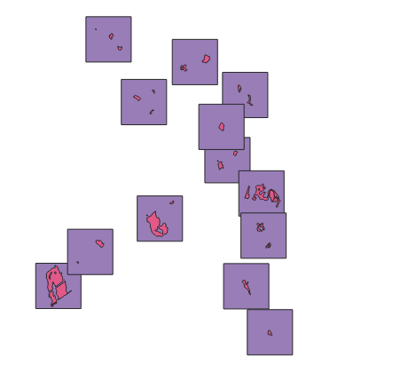

# Introduction 
This repo keeps functions that could be of help when working with vectorized or raster data.

## createcontainingextents

Functions that minimized number of squares needed to cover a set of polygons. 
Output is a geopackage file with all squares.

<p style="text-align: center;">
    Example of extents around clusters
</p>


### Run
```python   
from  AIRasterDataprocessing.createcontainingextents.coarse_clustring import coarse_clustering_of_points
from  AIRasterDataprocessing.createcontainingextents.point_clustring import point_clustering_to_boxes

searchstring = './createcontainingextents/data/bidos_nnk_1000_examples.gpkg'
output_path = './out'
max_n_in_cluster = 1500 
im_size = 1280 #storlek i meter
#Gör först en grov clustringsalgorithm på alla polygoner
coarse_clustering_of_points(searchstring, output_path, max_n_in_cluster)

#Gör en finare uppdelning utifrån den grova indelningen
point_clustering_to_boxes(f'{opt.output_path}/*coarse.gpkg', output_path, im_size=im_size, write_eval=False)
```

## rastermodifications
Functions to manipulate rasters

### geometric_correction.py
Tries to minimize the geometric difference between an image pair

#### Run
```python
from AIRasterDataprocessing.rastermodifications.geometric_correction import geometric correction

im1_path='./AIRasterDataprocessing/rastermodifications/data/id_0_1499299200000_0_0_ndvi.tiff'
im2_path='./AIRasterDataprocessing/rastermodifications/data/id_0_1502928000000_0_1_ndvi.tiff'

im1=gdal.Open(im1_path).ReadAsArray()
im2=gdal.Open(im2_path).ReadAsArray()

im2_corr = geometric_correction(im1, im2, upsample_factor=100)
```

### radiometric_correction.py
Tries to reduce the difference between two images by a Linear mapping approach.

#### Run
```python
import gdal
from AIRasterDataprocessing.rastermodifications.radiometric_correction import radiometric_correction

im1_path='./AIRasterDataprocessing/rastermodifications/data/id_0_1499299200000_0_0_ndvi.tiff'
im2_path='./AIRasterDataprocessing/rastermodifications/data/id_0_1502928000000_0_1_ndvi.tiff'

im1=gdal.Open(im1_path).ReadAsArray()
im2=gdal.Open(im2_path).ReadAsArray()

im2_corr = radiometric_correction(im1, im2)
```

# Install 
To install first clone this repo
```
cd FOLDER_NAME
python -m pip install .
```
In the early days of this repo there is some development potential of this project. In order to ease the development process it might be useful to install the package in editable mode. By doing so you wont need to reinstall to trigger the changes:
```
cd FOLDER_NAME
python -m pip install -e .
```
# TODOs
## createcontainingextents
* The matrices becomes quite large after a while. As for now number the max number of clusters should be set to approx 1500 on an ordinary combuter. The algorithm could be made more memory efficient.
* Create better input output. This should be done once the workflow around this projekt is getting started.
* There has been zero effort trying to minimize the overlapping areas. The inner rectacle containg all clusters in that cluster can be written by the tag ```write_eval```. Solving this could potentially increase learning of the model since there will be no increase in memory usage or diskspace. 